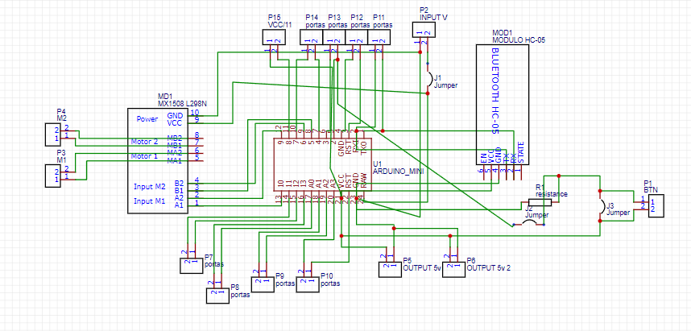

# Kit-Robot-Sumo
O robô proposto, é um robô com concebido para uma modalidade desportiva de luta de sumo. O modelo tem incluído 2 motores, 2 sensores de Infravermelhos para deteção do fim da arena, um sensor de infravermelhos para deteção do oponente, um módulo Bluetooth, modulo de controlo de motores, bateria e Chassi (com rodas e pneus incluídos).
O Robô foi desenhado para ser fácil de montar e desmontar com uma placa de circuito impressa onde estão acopladas todas as fichas e módulos necessários para o funcionamento do robô.
Apesar a finalidade principal deste robô ser competir na modalidade de luta de sumo, com alteração da programação também é possível criar outros projetos sem que seja necessário a alteração física do robô.

# Lista de Projetos possíveis apenas com alteração da programação:
• Robô para luta de sumo
• Robô segue objeto
• Robô segue-linha
• Robô controlado por um dispositivo android através do bluetooth

# Fotografias
## Fotografias do modelo 3d

## Fotografias da placa de circuito

https://collaborate.shapr3d.com/v/yR_ax6GxeDpEmJNjslQsc

# Regras da competição
- Os robôs não podem medir mais de 15*15cm
- Não podem ultrapassar 500 gramas de peso total (incluindo a bateria) 
- Não é permitido qualquer tipo de de sistema de controlo remoto
- Não são permitadas placas de controlo com qualquer tipo de sistema remoto incluido (e.g. Wifi, Bluetooth), uma vez detectado não será autorizado a competir
- Cada round tem uma duração máxima de 3min
- cada batalha é à melhor de 3 e em caso de empate combatem até algum perder
- Se o robô não se mexer o juiz conta até 3 e se o robô não se mexer é dado como derrotado perdendo assim a ronda
- Um robô perde quando sai da arena na sua totalidade (caso a arena tenha altura o robô perde quando tocar com uma roda na parte de fora da arena)
- Voltagem máxima de funcionamento dos robôs é de 10v
- Não é permitida qualquer tipo de arma amovivel (O objetivo é apenas empurrar o oponente) 

Arena
2. Especificações do Dohyo
(1) Dohyo será uma moldura circular de alumínio de 154 cm de diâmetro (incluindo Tawara) que é coberta por uma folha preta de SPCC localizada na parte superior a 5 cm de altura.
3. Shikiri-Sen
Shikiri-Sen deve ser indicado como duas linhas marrons com largura de 2 cm e comprimento de 20 cm. Cada linha deverá estar localizada a 10 cm à direita e à esquerda do centro do Dohyo.
4. Tawara
(1) Tawara será indicado por uma linha circular branca de 5 cm de largura, do interior até a linha externa do Dohyo (O Tawara será considerado como dentro do Dohyo).
5. Yochi
Yochi será uma área quadrada cujo lado mede 360 ​​cm. A forma e o material são livres, mas deve-se prestar atenção à segurança.

